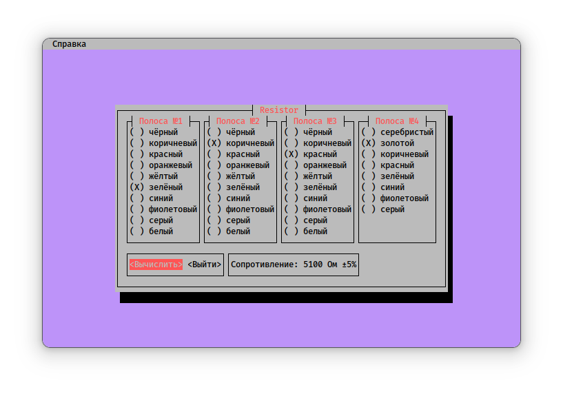

# Resistor



Консольная программа для вычисления сопротивления резисторов по цветной маркировке. На данный момент (версия 0.1) поддерживается только вычисление сопротивления резисторов с четырьмя полосами. В будущем будет добавлена возможность измерения сопротивления резисторов и с иными маркировками.

## Сборка и использование

- **Зависимости:** `rustc`, `cargo`

### Сборка

```bash
cargo build --release
```

### Использование

```bash
./target/release/resistor
```

Также вы можете добавить двоичный файл `resistor` в любую директорию, указанную в переменной окружения `PATH`, например, в `~/.local/bin`:

```bash
cp ./target/release/resistor ~/.local/bin/resistor
```

Запуск в таком случае:

```bash
resistor
```

<!-- ## Донат

> Сбербанк: 2202206252335406 -->

## TODO

- [ ] Добавление графического интерфейса GTK4 + `libadwaita`
- [ ] Создание пакетов для дистрибутивов
  - [ ] ArchLinux
  - [ ] Debian GNU/Linux
  - [ ] Fedora
- [ ] Нормальный логотип
