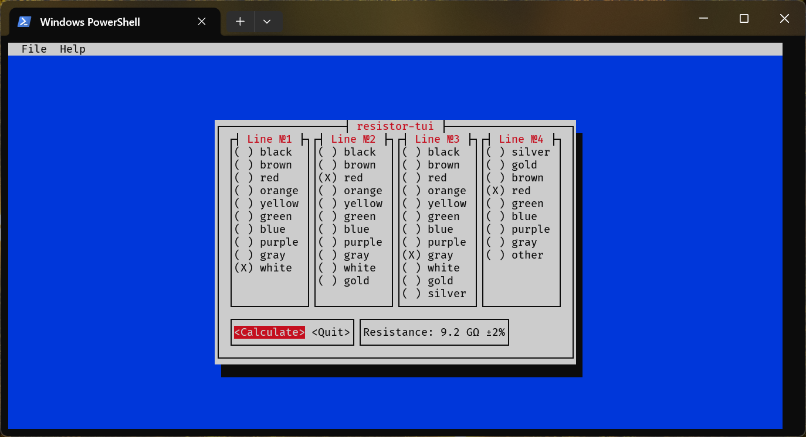

# Resistor




Программа для вычисления сопротивления резисторов по цветной маркировке. На данный момент поддерживается только вычисление сопротивления четырёхполосных резисторов.

## Сборка и использование

- **Зависимости:** `rustc`, `cargo`

### Сборка

```bash
cargo build --release
```

### Использование

```bash
./target/release/resistor_[gui или tui]
```

Также вы можете добавить двоичный файл `resistor` в любую директорию, указанную в переменной окружения `PATH`, например, в `~/.local/bin`:

```bash
cp ./target/release/resistor_* ~/.local/bin/
```

Запуск в таком случае:

```bash
resistor_[gui или tui]
```

## TODO

- [X] Добавление графического интерфейса Iced
- [ ] Создание пакетов для дистрибутивов
  - [ ] ArchLinux
  - [ ] Debian GNU/Linux
  - [ ] Fedora
- [ ] Нормальный логотип
